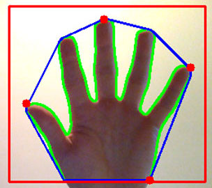
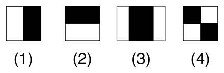

# Langage des signes

Mise en place d'un classifieur d'images pour distinguer les différentes lettres du langages des signes francais, et en réaliser une transcription automatique.

Il sera, dans un premier temps, classifié les lettres distinguables sans mouvements (le traitement d'images étant moins complexe que le traitement vidéo), et sans les mots/phrases qui possèdent un signe/mouvements chacuns
## Première itération   

### Outils

Tensorflow  
[Dataset](https://sites.google.com/site/autosignlan/source/image-data-set)  
Training : [retrain.py](https://github.com/tensorflow/tensorflow/blob/master/tensorflow/examples/image_retraining/retrain.py)  
Eval : [label.py](https://github.com/llSourcell/tensorflow_image_classifier/blob/master/src/py/label_dir.py)  

### Workflow
Utilisation de docker pour développement indépendant de la machine hôte (dans mon cas, depuis windows).  
Le probleme de docker est qu'il ne peut tirer parti du GPU (sur windows!, sur les systemes compatibles, il existe [nvidia-docker](https://github.com/NVIDIA/nvidia-docker), à tester sur la Jetson donc.)  

#### Docker (quick start terminal):  

    docker run -it gcr.io/tensorflow/tensorflow:latest-devel   # Crée un container docker qui contient la derniere version de tensorflow/tensorflow  
    mkdir /tf_files   # Crée un dossier pour récuperer les fichiers utiles  
    exit   # Quite la vm pour y lier les tf_files  
    
    docker run -it -v $HOME/tf_files:/tf_files gcr.io/tensorflow/tensorflow:latest-devel   # lance le container avec /tf_files en commun avec le pc  
    
    # ouverture du terminal du container (si besoin):  
    # docker attach <name>
    
    # Lance l'entrainement sur les fichiers jpg du dossier /tf_files/signSplit      
    cd /tensorflow
    python tensorflow/examples/image_retraining/retrain.py \
        --bottleneck_dir=/tf_files/bottlenecks \
        --how_many_training_steps 4000 \
        --model_dir=/tf_files/inception \
        --output_graph=/tf_files/retrained_graph.pb \
        --output_labels=/tf_files/retrained_labels.txt \
        --image_dir /tf_files/signSplit 
    
    # Lance la prédiction
    python /tf_files/label.py /tf_files/sign/<number>.jpg
    
#### Contenu de tf_files
    
    sign/  
        A/  
        B/  
        C/  
    signSplit/  
        A/  
        B/  
        C/
    label_image.py  
    modif.py   # Renomme les fichiers de train  
    splitData.py   # Coupe les données de train
    
convertion images ppm en jpg

    # install imagemagick 
    sudo apt-get install imagemagick
    convert *.ppm %d.jpg
    
### Premiers Résultats
Une classification sur 3 signes distincts avec environ 100 images pour chaque cas d'entrainement mene a une exactitude (final test accuracy) de 94%  

D'autres campagnes de tests automatisés seronts à réaliser pour produire des schémas de performances de ce modeles, pour essayer d'en trouver les faiblesses dans notre contexte de la reconnaissance du langages des signes, pour enfin essayer d'augmenter les performances de classification. 
Les tests s'avèrents relativememnt bons sur le meme dataset (mais des images qu'il n'as pas appris), cependant, apres un test sur une image de l'exterieur du dataset, les resultats sont médiocres.  
Nous avons mis aux point un script de generation de dataset a l'aide de la webcam (linux uniquement, paquets streamer et tkinter necéssaires).  
A tester donc.

### A voir pour la deuxieme expérimentation

[Nvidia docker](https://github.com/NVIDIA/nvidia-docker/wiki/Why%20NVIDIA%20Docker)  
Installation de docker sur ubuntu [3 versions](https://docs.docker.com/engine/installation/linux/ubuntulinux/) ou [16.04](https://www.digitalocean.com/community/tutorials/how-to-install-and-use-docker-on-ubuntu-16-04)  
[Installation de nvidia-docker](https://github.com/NVIDIA/nvidia-docker)  
[Tensorflow image on nvidia-docker](https://github.com/tensorflow/tensorflow/tree/master/tensorflow/tools/docker)  

 
# Deuxième itération  

Nos premiers essais de classifications des signes étaient un echec, cependant nous nous attendions a ce résultat, mais il fallait commencer par la pour avancer.  
L'idée était de mettre en place un classifier d'image quelquonque (nous avons utilisé le (...retail?) de tensorflow) sur un dataset trouvé sur internet comportant des images de signes.  
Nous avons fait des essais sur des données d'apprentissages variés, mais peu nombreuses (50aine de photos, séparés en 3 signes distincts.)
En séparant le corpus en corpus de tests et d'apprentissage, les résultats semblait plutot bons (~60%), cependant, les essais réels était médiocre (non mesurés, mais je dirai maximum 5 % de bonnes classifications).  
Nous avons déduit de cette expérience que les données d'apprentissages importe énormement sur la classification, et que les conditions/environements de capture sont très influents.  
Il nous faudra donc faire du traitement d'image, pour, a minima retirer le maximum de fond de l'image, et si possible, couper les parties de l'image des mains pour les isoler, et y appliquer des traitements, pour le training, et la classification.  
On espere aussi réduire la taille des données en entrée du systeme pour permetre des calculs plus rapide.

## Traitements d'image utilisés  

### Grayscale  
Le passage des images en niveau de gris permet de grandement diminuer la taille de celle-ci, en revanche ce traitement est destructif pour des informations qui peuvent être capitale.  
On appliquera ainsi ce traitement, mais pas forcément au début de la chaine de traitement.  

### Blur-Gauss  
Application d'un filtre qui permet de flouter legerement l'image. Cela nous permet de diminuer les détails bruités de l'images, pour se concentrer sur les formes plus importantes.  

### BG-Remove  
Ce traitement permet d'extraire l'information qui n'est pas immobile sur l'image.  
Elle se base sur la capture de plusieurs trames, et une soustraction des pixels qui n'ont pas changé, avec un certain controle par des parametres de réglages.  
Cette technique consomme relativement peu de ressource par rapport au gain d'espace de travail utile.  
L'utilisation de cette technique permet également un affinage en fonction du temps. En effet, lorsque l'utilisateur arrive dans l'image, la zone analysé est assez grande, mais celle ci se reduit très vite car l'utilisateur bouge peu ( relativement a la main qu'il présente a la caméra )  

### Contours/Convex Hull/Boundingbox  
 
L'algorithme de recherche des contours permet de trouver des zones des couleurs semblables, et tracer leurs coutours.  

A partir de ces resultats, on peut extraire les convex-hull. Il s'agit de détourer au mieux une forme, en retirant ainsi beaucoup d'information (les coutours détaillés) en conservant celle qui nous intéressents.  
  

A partir de ces zones sont facilement extrayable les boudings-box (zones rectangle ou éllipsoïdales), qui bornent les zones qui nous interressents. En dilattant les convex hull, ou les bounding-box, on permet d'etre plus large sur l'image que l'on va scrop.  

  

## Cascade Haar / Viola and Jones  
L'agorithme de detection en cascade est une technique de reconnaissance d'objet dans une image.  
Cet algorithme est utilisé depuis 2001 pour la localisation de visages dans les images. Cependant, il peut apprendre a localiser n'importe quel type d'objets, et de trouver les bounding boxes des objets qu'on lui aura fait apprendre.  

Elle se base sur le calcul des zones de couleurs d'ondelettes, et un entrainement permettant de déduire un modele de vraisemblance pour ces ondelettes.  
Le calcul semble a premiere vu énorme, mais en convertissant dans un format addapté pour ce calcul, il se fait en 4 opérations basiques.  

Ainsi il nous permettrait, soit de remplacer notre modele précédent (bg remove/convexhull, meme si aucun traitement concernant les mains n'était encore incorporé), soit le renforcer (avant ou apres, ou en prenant une décision par rapport aux réponses des 2 systemes.)  

De plus, les versions a l'état de l'art l'utilisent de facon cascade (Cascade Classifier), ce qui nous permettrait aussi de faire la reconnaissance à proprement parler des signes de la main.  

 
 
 

### Implémentation Python et GPU:  
Avec les librairiesPython [OpenCV](https://github.com/Itseez/opencv) et [OpenCV GPU](https://github.com/alexanderkoumis/opencv-gpu-py), détecter des objets avec un fichier d'entrainement est très facile:  

    if cv2gpu.is_cuda_compatible():  
        cv2gpu.init_gpu_detector(cascade_file_gpu)  # training file  
        
    detections = cv2gpu.find_faces(image_file)  

## Définition du besoin  
Il nous maintenant faire des essais de la meilleure combinaison de systemes.  
L'impact du sens d'application des traitements étant importants et peu prévisible, cela demanderais trop de temps et nous allons faire un maximum d'essais, en fonction de nos prévisions.  
Cependant rien ne nous indique que nous optiendrons le meilleur modèle.  

Il faut enfin créer un programme de création de dataset a l'aide de webcam, pour obtenir plus de données d'entrainement.  
Ce programme n'étant pas a priori compliqué, il faut néanmoins qu'il soit facilement parametrable pour créer des datasets de tailles variables (pour nos tests, et pour un déployement imaginable).  
On pourrait nottament penser a une interface de parametrage par l'utilisateur de ces datasets. Il pourrait ainsi ajouter lui meme des signes dont nous ignorons l'existence.

Il nous faut définir des campagnes de tests adaptés pour juger nos systèmes, et nos datasets, cependant, je ne pense pas qu'on ai le temps de tester les datasets ( j'imagine qu'en comparant la vraisemblance avec les modeles déja appris on pourrais filtrer les cas ou l'utilisateur s'es trompé, mais on sors du  cadre du projet). En revanche, il faut qu'on puisse tester automatiquement les systemes. 

