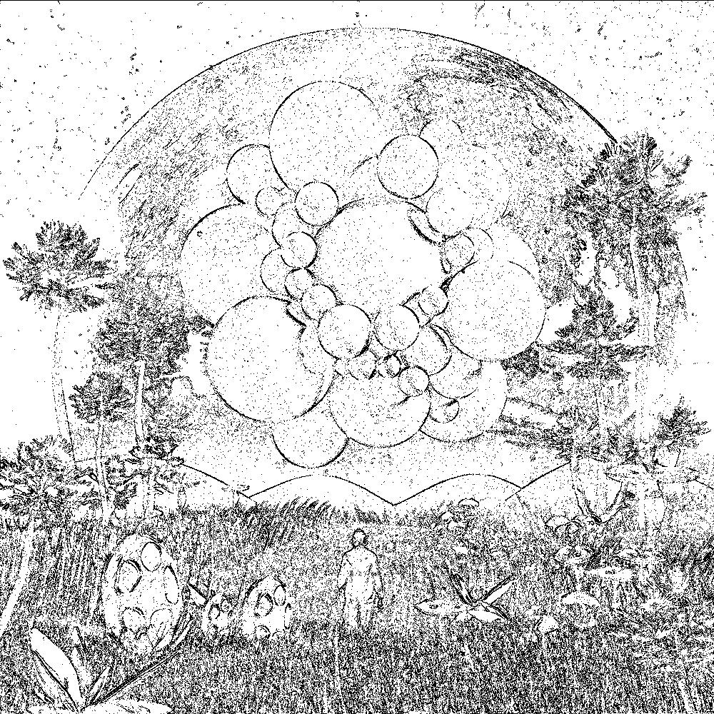
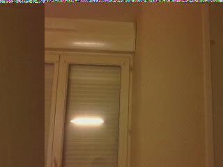
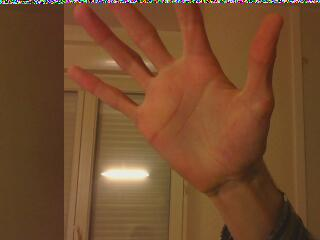

# Traitement D'image
 
Parmi les proof of concept, étant donner que les autres travaillait avec CUDA en C++, j'ai décider de faire avec le langage Python, et la librairie [PyCuda](https://documen.tician.de/pycuda/).  
Pycuda permet d'executer des kernels materiels écrit en C++, mais dispose également d'un binding, que je n'ai pas (encore) utilisé: limiter le code C++ a la fonction materielle me suffisant, l'interet du python est alors de structurer simplement le reste du programme, nottament les interfaces.  
Nos proof of concept ne se font pas sur des versions optimisés des algorythmes, mais il se font cependant avec le même calcul, juste le GPU execture le traitement en parralele.  

Nous avons appliqué les traitements du Threshold et de la détection de contours sur l'image suivante, et le retrait du fond avec nos webcams.  

  

## Threshold.

Nous avons juste reinventer la roue pour implementer le principe du tresold d'abord en C++(utilisant la librairie Opencv) et ensuite en CUDA. 
Le principe est simple, nous comparons les valeurs des pixels d'image par rapport à un seuil donné. si la valeur est superieur au seuil le pixel est mis en blanc sinon en noir. l'image resultant est alors une image blanc-noire.

### Implementation CPU

Pour la partie C++ ce n'était pas trop compliqué. Nous avons en effet chargé l'image et ensuite comparé les valeurs de chaque pixel au seuil (seuil = 128) et par la suite construit la nouvelle matrice de pixel et enfin enregistré. Nous avons très vite eu notre nouvelle image qui est bien blanc-noir.

### Implémentation GPU

Pour la partie Cuda nous avons eu à gérer plusieurs choses. Nous avons d'abord chargé la matrice de pixels envoyé vers le device.la comparaison du pixel avec le seuil et l'affection de la nouvelle de pixel se font dans le code du kernel. Nous enfin récupérer la nouvelle matrice de pixel pour stocker l'image final. A chaque nous avons traité les exceptions moyennant le type d’exception cudaError_t predéfinies dans Cuda. Voici quelques cas dans lesquels nous avons traité ces exceptions 
- pendant l'allocation de la matrice de pixel s'executant côté matériel (cudaMalloc):

- pendant la copie de la matrice (host ->device) tout comme (device -> host) (CudaMemcpy)

- après l'execution du kernel, nous nous assurons que l'exécution s'est bien passé 
(CudaGetLastError: méthode qui retourne les erreurs s'ils en existe)

- pour l'affichage de les exceptions, nous utilisons la fonction CudaGetErrorString() sur notre type d'erreur.

  

## Coutours  
Pour la detection de contours, j'ai décider d'utiliser PyCuda pour implémenter le traitement, car nous utiliserons Python pour le projet final, et pycuda s'utilise comme Cuda C++ :  
on écrit une fonction kernel, et on l'appel depuis python. Lors de la premiere execution, le kernel est compilé, et est réutilisé les fois d'après.  

### Implémentation CPU
~~~~
def contoursDetectCPU(pix):
    seuil = 20

    pixRes = np.zeros(pix.shape)
    x = pix.shape[0]
    y= pix.shape[1]

    for j in range(1,y-1):
        temp = []
        for i in range(1,x-1):

            diffX = sum(pix[i-1][j])-sum(pix[i+1][j])
            diffY = sum(pix[i][j-1])-sum(pix[i][j+1])

            if(diffX > seuil)or(diffY > seuil):
                col = (0,0,0)
            else:
                col = (255,255,255)
            pixRes[i][j] = col
    return(pixRes)
~~~~

### Implémentation GPU
~~~~
#fonction kernel
mod = SourceModule("""
#include <stdio.h>
#include <stdlib.h>
__global__ void contour(float *im,float* res, int* x, int* y)
{
int seuil = 20;
int size = int(x)*3;
int begin = threadIdx.x*3;

for(int j = 1; j<1000-1;j+=10){
    for(int i = 3; i < size-3 ;i+=10*3){
        int idx = i+begin + (threadIdx.y*1000*3) + (j*1000*3);

        int caseD = idx + 3; int caseG = idx - 3; int caseH = idx - (1000*3); int caseB = idx + (1000*3);
        
        int diffX = abs(im[caseD]+im[caseD+1]+im[caseD+2]-(im[caseG]+im[caseG+1]+im[caseG+2]));
        int diffY = abs(im[caseH]+im[caseH+1]+im[caseH+2]-(im[caseB]+im[caseB+1]+im[caseB+2]));
        
        if((diffX>seuil)&&(diffY>seuil)){
            res[idx] = 0;  res[idx+1] = 0; res[idx+2] = 0;
        }
        else{
            res[idx] = 255; res[idx+1] = 255; res[idx+2] = 255;
        }
    }
}

}
""")

def contoursDetectCPU(pix):
    pixRes = np.zeros(pix.shape)
    x = np.int32(pix.shape[0])
    y = np.int32(pix.shape[1])

    # converti en float simple precision
    pix = pix.astype(np.float32)

    # alloue memoire gpu
    im_gpu = cuda.mem_alloc(pix.nbytes)
    res_gpu = cuda.mem_alloc(pix.nbytes)
    x_gpu = cuda.mem_alloc(sys.getsizeof(x))
    y_gpu = cuda.mem_alloc(sys.getsizeof(y))

    # transfer array args
    cuda.memcpy_htod(im_gpu, pix)
    cuda.memcpy_htod(res_gpu, np.empty_like(pix))

    func = mod.get_function("contour")
    func(im_gpu, res_gpu, x , y , block=(10,100,1))
    result = np.empty_like(pix)

    cuda.memcpy_dtoh(result, res_gpu)
    return(result)
~~~~

### Résultats
L'implementation du detecteur de contours s'éxecute en X ms sur CPU et Y ms sur GPU pour une image. Encore une fois la méthode est basique, et nos nouvelles connaissances nous permettrait de faire mieux (Produit de convolution d'un certain filtre, le produit de convulution ayant surement des optimisations majeurs sur CPU et GPU. Nos résultats sont donc représentatif par rapport a leurs implémentions seulement.)  
  

## Backgroud Remover

### Implémentation CPU  
~~~~
def bgRemoveCPU(bg,pix):
    seuil = 10
    pixRes = np.zeros(pix.shape)
    x,y = (pix.shape[0],pix.shape[1])

    for j in range(1,y):
        for i in range(1,x):
            diff = abs(sum(pix[i][j])/3-sum(bg[i][j]/3))

            if(diff > seuil):    col = pix[i][j]
            else:                col = (255,255,255)

            pixRes[i][j] = col
            
    return(pixRes)
~~~~

### Implémentation GPU  
~~~~
#fonction kernel
mod = SourceModule("""
#include <stdio.h>
#include <stdlib.h>

__global__ void bgremove(float *bg, float * im,float* res, int* x, int* y)
{
int seuil = 10;
int size = int(x)*3;
int begin = threadIdx.x*3;

for(int j = 1; j<1000-1;j+=10){
    for(int i = 3; i < size-3 ;i+=10*3){
        int idx = i+begin + (threadIdx.y*1000*3) + (j*1000*3);

        int intIm = (im[idx]+im[idx+1]+im[idx+2])/3;
        int intBG = (bg[idx]+bg[idx+1]+bg[idx+2])/3;

        int diff = abs(intIm - intBG);

        if(diff>seuil){
            res[idx] = im[idx]; res[idx+1] = im[idx+1]; res[idx+2] = im[idx+2];

        }
        else{
            res[idx] = 255; res[idx+1] = 255; res[idx+2] = 255;
        }
    }
}

}
""")

def bgRemoveGPU(pixBG,pixIm):

    print "debut algo gpu"
    t0 = time.time()

    x = np.int32(pixBG.shape[0])
    y = np.int32(pixBG.shape[1])

    # converti en float simple precision
    pixBG = pixBG.astype(np.float32)
    pixIm = pixIm.astype(np.float32)

    # alloue memoire gpu
    BG_gpu = cuda.mem_alloc(pixBG.nbytes)
    im_gpu = cuda.mem_alloc(pixIm.nbytes)
    res_gpu = cuda.mem_alloc(pixBG.nbytes)
    x_gpu = cuda.mem_alloc(sys.getsizeof(x))
    y_gpu = cuda.mem_alloc(sys.getsizeof(y))

    # transfer array args
    cuda.memcpy_htod(BG_gpu, pixBG)
    cuda.memcpy_htod(im_gpu, pixIm)
    cuda.memcpy_htod(res_gpu, np.empty_like(pixBG))

    func = mod.get_function("bgremove")
    func(BG_gpu, im_gpu,res_gpu,x , y , block=(10,100,1))
    result = np.empty_like(pixBG)

    cuda.memcpy_dtoh(result, res_gpu)

    tn = abs(t0-time.time())
    print "fin algo gpu en ",tn, " s"
    return(result)
~~~~

### Resultats
Mon implémentation s'éxecute en X ms sur CPU et Y ms sur GPU, cependant le résultat est moyen, et ne fonctionne pas en mode viédeo pour une raison qui m'échappe..  

Fond:  
  

Image a traiter:  
  

Image sans le fond:  
  
